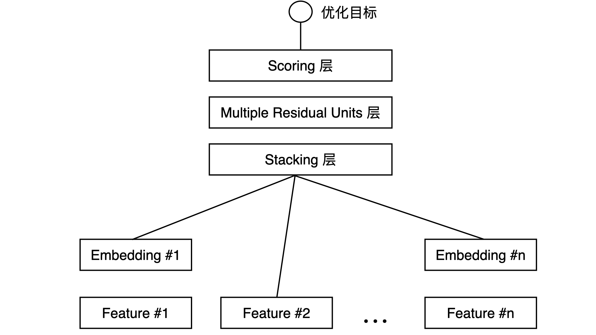

# RecommendAlgorithm
本项目使用 TensorFlow、PySpark、Sklearn 实现了一些工业界经典的推荐算法模型

## 环境要求
* python 3.7
* pyspark 2.4
* tensorflow 2.0 +
* scikit-learn 0.21

## 数据集介绍
- 电影评分数据集，包括测试集（trainingSamples.csv）和训练集（testSamples.csv）。数据集为用户给电影评分的日志，评分大于等于3.5为正样本，小于3.5为负样本，另外数据集已经拼接了用户特征和电影特征

## 推荐算法模型
### [DeepCrossing](https://github.com/jason-wang1/RecommendAlgorithm/blob/master/tensorflowrec/DeepCrossing.py)
DeepCrossing 是微软在2016年提出的CTR模型，用于Bing搜索引擎的广告搜索推荐场景。其结构如下：
- Feature层：包括类别型特征与数值型特征
- Embedding层：类别型特征需要做embedding处理，数值型特征不需要
- Stacking层：将embedding特征与数值型特征拼接起来
- Multiple Residual Units 层：由残差神经元组成的多层神经网络（本案例使用普通感知机组成的多层神经网络）
- Scoring 层：输出层，取值范围为[0, 1]



训练集效果：
```
7403/7403 [==============================] - 106s 14ms/step - loss: 2.5708 - auc: 0.5857
Epoch 2/5
7403/7403 [==============================] - 85s 12ms/step - loss: 0.6333 - auc: 0.7135
Epoch 3/5
7403/7403 [==============================] - 108s 15ms/step - loss: 0.5551 - auc: 0.7814
Epoch 4/5
7403/7403 [==============================] - 84s 11ms/step - loss: 0.5178 - auc: 0.8160
Epoch 5/5
7403/7403 [==============================] - 86s 12ms/step - loss: 0.4954 - auc: 0.8346
```
测试集效果：
```
1870/1870 [==============================] - 16s 9ms/step - loss: 0.6003 - auc: 0.7541
```
