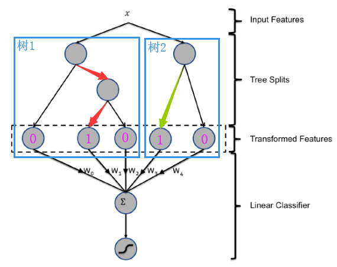

# RecommendAlgorithm
本项目使用 TensorFlow、PySpark、Sklearn 实现了一些工业界经典的推荐算法模型

## 环境要求
* python 3.7
* pyspark 2.4
* tensorflow 2.0 +
* scikit-learn 0.21

## 数据集介绍
电影评分数据集，包括[训练集](data/trainingSamples.csv)和[测试集](data/testSamples.csv)。数据集为用户给电影评分的日志，数据集已经拼接了用户特征和电影特征，数据集字段包括：

| 字段名称 | 字段含义 |
| ---- | ---- |
|   movieId   |   电影id   |
|   userId   |   用户id   |
|   rating   |   评分，分值在[0, 5]之间   |
|   timestamp   |   评分的时间   |
|   label   |   样本标签。评分大于等于3.5时，label为1；评分小于3.5时，label为0   |
|   releaseYear   |   电影发行年份   |
|   movieGenre1 ~ movieGenre3   |   电影的类型   |
|   movieRatingCount   |   对该电影有过评分的用户数   |
|   movieAvgRating   |   该电影评分的平均值   |
|   movieRatingStddev   |   该电影评分的标准差   |
|   userRatedMovie1 ~ userRatedMovie5   |   用户最近好评过的电影id   |
|   userRatingCount   |   用户评分总数   |
|   userAvgReleaseYear   |   用户好评电影年份的平均值   |
|   userReleaseYearStddev   |   用户好评电影年份的标准差   |
|   userAvgRating   |   用户评分平均值   |
|   userRatingStddev   |   用户评分标准差   |
|   userGenre1 ~ userGenre5   |   用户喜欢的电影风格   |


## 推荐算法模型
### GBDT+LR
#### 算法简介
GBDT+LR 是FaceBook在2014年提出的CTR模型，用于广告推荐场景。它是由GBDT和LR两个模型组合而成：
- GBDT 用于特征的自动筛选、交叉，树的深度决定了特征交叉的阶数，最终生成新的特征向量。相比RF，GBDT每颗树学习到的特征划分与组合方式都有所区别
- LR模型的输入即为GBDT输出的特征向量
- GBDT 用于构建特征工程，LR用于CTR预估，这两部分模型是独立训练的


#### [GBDT+LR算法实现](https://github.com/jason-wang1/RecommendAlgorithm/blob/master/sklearnrec/gbdt_lr.py)
- GBDT模型采用`lightgbm`实现，LR模型采用`sklearn`实现
- 数据集为`电影评分数据集`
- 训练集效果：
    ```
    train_log_loss:  0.5462617591783033
    train_auc:  0.7896601538547148
    ```

- 测试集效果：
    ```
    test_log_loss:  0.5645459026988678
    test_auc:  0.7726261543531365
    ```


### DeepCrossing
#### 算法简介
DeepCrossing 是微软在2016年提出的CTR模型，用于Bing搜索引擎的广告搜索推荐场景。其结构如下：
- Feature层：包括类别型特征与数值型特征
- Embedding层：类别型特征需要做embedding处理，数值型特征不需要
- Stacking层：将embedding特征与数值型特征拼接起来
- Multiple Residual Units 层：由残差神经元组成的多层神经网络（本案例使用普通感知机组成的多层神经网络）
- Scoring 层：输出层，取值范围为[0, 1]


#### [DeepCrossing算法实现](https://github.com/jason-wang1/RecommendAlgorithm/blob/master/tensorflowrec/deep_crossing.py)
- 采用`tensorflow`实现
- 数据集为`电影评分数据集`
- 训练集效果：
    ```
    7403/7403 [==============================] - 106s 14ms/step - loss: 2.5708 - auc: 0.5857
    Epoch 2/5
    7403/7403 [==============================] - 85s 12ms/step - loss: 0.6333 - auc: 0.7135
    Epoch 3/5
    7403/7403 [==============================] - 108s 15ms/step - loss: 0.5551 - auc: 0.7814
    Epoch 4/5
    7403/7403 [==============================] - 84s 11ms/step - loss: 0.5178 - auc: 0.8160
    Epoch 5/5
    7403/7403 [==============================] - 86s 12ms/step - loss: 0.4954 - auc: 0.8346
    ```
- 测试集效果：
    ```
    1870/1870 [==============================] - 16s 9ms/step - loss: 0.6003 - auc: 0.7541
    ```
